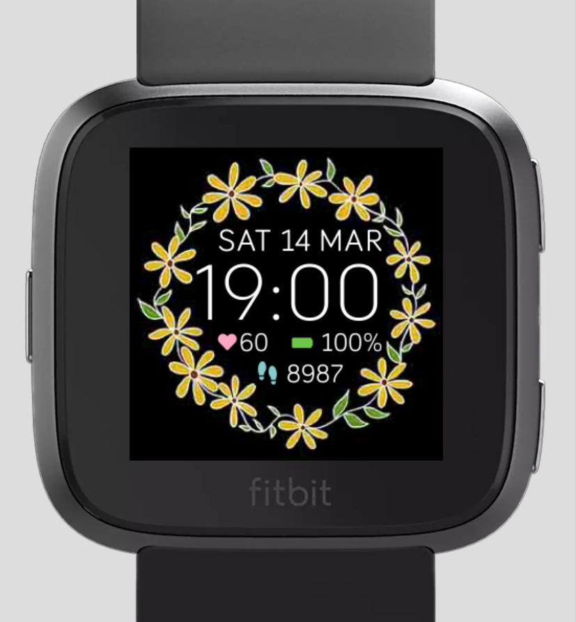

# Daisy Wreath WatchFace
A clockface for fitbit versa with a hand-drawn daisy wreath.

## Technologies Used
- JavaScript
- CSS3
- Fitbit Studio

## Features
- User can see time either in 24 hour or 12 hour
- User can see fitbit battery level
- User can see current heart rate
- User can see amount of steps they accrued during the day
- User can see today's day of week
- User can see today's date and month

## Example of App

